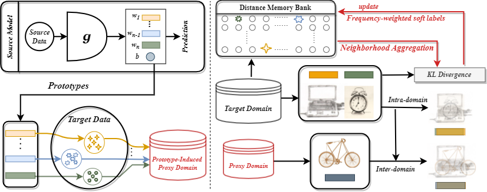

# Official Implementation for ProxyMix
[ProxyMix: Proxy-based Mixup Training with Label Refinery for Source-Free Domain Adaptation](https://arxiv.org/pdf/2205.14566.pdf)

This implementation is based on [ATDOC](https://github.com/tim-learn/ATDOC).
### Framework:  

1. train on the source domain;
2. Construct the proxy source domain and train on target dataset.



### Prerequisites:
- python == 3.6.8
- pytorch ==1.1.0
- torchvision == 0.3.0
- numpy, scipy, sklearn, PIL, argparse, tqdm

### Dataset:

- Please manually download the datasets [Office](https://drive.google.com/file/d/0B4IapRTv9pJ1WGZVd1VDMmhwdlE/view), [Office-Home](https://drive.google.com/file/d/0B81rNlvomiwed0V1YUxQdC1uOTg/view), [VisDA-C](https://github.com/VisionLearningGroup/taskcv-2017-public/tree/master/classification) from the official websites, and modify the path of images in each '.txt' under the folder './data/'. [**How to generate such txt files could be found in https://github.com/tim-learn/Generate_list **]


### Training:
1. ##### Office-31 dataset
	```python
    # train source model
    python train_source.py --dset office --s 0 --max_epoch 50
    # train target model
    python train_target.py --dset office --easynum 5 --output test --gpu_id 7 --s 0 --t 1
    python train_target.py --dset office --easynum 5 --output test --gpu_id 7 --s 0 --t 2
	```
2. ##### Office-Home dataset
	- Coming soon ...
3. ##### VISDA-C dataset
	- Coming soon ...


### Citation

If you find this code useful for your research, please cite our papers
```
@article{ding2022proxymix,
  title={ProxyMix: Proxy-based Mixup Training with Label Refinery for Source-Free Domain Adaptation},
  author={Ding, Yuhe and Sheng, Lijun and Liang, Jian and Zheng, Aihua and He, Ran},
  journal={arXiv preprint arXiv:2205.14566},
  year={2022}
}
